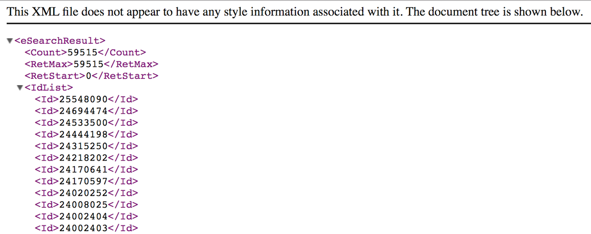

# Introduction

  This report documents data analytics process for obesity comorbidity analysis on data retrieved from NCBI. This is an assignment from Brown University's the CIS Data Science Practice for assessing Chloe Li's technical skills.
  
  *NOTE: Select **Hide Code** to hide all R codes.*

  The objective of tis assignment is to conduct a comorbidity analysis for obesity using NCBI's PubMed database. The data was selected based on a date range of __2000 to 2012__, with a major MeSH descriptor of __"obesity"__ and semantic types of __"Disease or Syndrome"__.


```{r prep, echo=TRUE, message=FALSE, warning=FALSE}
#preparation

#clear environment if needed
rm(list = ls())

#set working directory
setwd('~/Documents/Dev_dataScienceProjects/BrownUniv/')

#load function
source('./PubmedXML_Dict_Fun.R')


#install/reuqire libraries
if (!'pacman' %in% installed.packages()){
  install.packages('pacman')
}

pacman::p_load("ggplot2","dplyr", "rentrez","knitr","RCurl","plyr","tidyr","data.table")

#rentrez is the package in R provides an interface to the NCBI's EUtils API
```


# Data

In order to retreive data based on date range and keywords, a correct search query should be formulated. The package of R named "rentrez" allows R users to pull data from NCBI. 

## PubMed Search

**entrez_db_summary()** shows summary of a certain database, in this case, **PubMed** database is used. 

- Database summary: **PubMed**
```{r, echo=TRUE, message=FALSE, warning=FALSE}
#show the database summary information
entrez_db_summary("pubmed")
```

**entrez_db_searchable()** shows searchable fields under a certain database, users can decide which keywords should be put under which searchable field. 

- List of **PubMed**'s *searchable fields* (below only shows **MAJR**)
```{r, echo=TRUE, message=FALSE, warning=FALSE}
#Searchable fields for database 'pubmed'
searchField <- entrez_db_searchable("pubmed")

searchField$MAJR
```

- In order to form the PubMed/MEDLINE search for articles between 2000 and 2012 with obesity indicated as the major MeSH descriptor, elements below should be included in the query:
    + *__MAJR__ - MeSH terms of major importance to publication* is used as searchable fields
    + **2000/01/01:2012/12/31[PDAT]** is date of publication/[PDAT]
    + **pubmed** is the database

Below shows the search result, which contains `r obesity_search$retmax` records and a web_history object; 
Here is the summary of search result:
```{r, echo=TRUE, message=FALSE, warning=FALSE}
query <- "obesity[MAJR] AND 2000/01/01:2012/12/31[PDAT]"

obesity_search <- entrez_search(db="pubmed",
                        query,
                        retmode = "xml",
                        use_history = TRUE,
                        retmax=60000)

kable(summary(obesity_search))
```

- A _web histroy_ was returned as well, which NCBI created for users who deals with very large queries. With this _web history_, all records based on the search query were stored on NCBI server waiting for further usage. 
```{r, echo=TRUE, message=FALSE, warning=FALSE}
obesity_search$web_history
```


- **The formulation of the PubMed search is shown below:**
```{r, echo=TRUE, message=FALSE, warning=FALSE}

obesity_search$QueryTranslation

```


In order to make sure this search result match with the number of records on NCBI. The same searching criteria were used on NCBI website manually, and the result is shown below:





## Data Retrival

Based on the search query, all records that matched with the criteria were found and all IDs were returned. Those IDs or the web history could be used to fetch all records from NCBI.
However, NCBI only allows users to pull 10,000 records at once. Therefore, a web history needs to be used to save the search result in the server so that all 59,515 records can be pulled from multiple batches. 

- Obtained PubMed/MEDLINE records (in MEDLINE or XML format) for the formulated search using NCBI E-Utilities 
- Extracted "pmid","authors","year","articletitle","meshHeadings" from all records and stored values into a data frame.

```{r, echo=TRUE, message=FALSE, warning=FALSE}
#fetch all records from the formulated search
source('./batchFetch_Fun.R')

#this returns a data frame with extracted information from all records
dt_sum <- batchFetch(obesity_search)
#function code will be shown at the end of this report

#save dt_sum in local so don't need to run every time
#write.csv(dt_sum, "obesity_SumTable.csv")

#dt_sum <- read.csv("obesity_SumTable.csv")
#dt_sum$X <- NULL

```


- Sample of the data frame

```{r, echo=TRUE, message=FALSE, warning=FALSE}
kable(dt_sum[1:3,])
```


To prepare the data for further analysis, two variables *authors* and *meshHeadings* should be re formatted since there are multiple values in one record for both variables. 
*authors* and *meshHeadings* variables should be unlisted so that each row represents an unique record of meshHeadings and authors with pmid, publication year and article title.

```{r, echo=TRUE, message=FALSE, warning=FALSE}
source('./unlistDT_Fun.R')

#return a data frame of 5 variables with each cell contains only single value
dt_tidy <- unlistDT(dt_sum)
#write.csv(dt_tidy, "tidy_obesitySearch.csv")
```


- Sample of the data frame
```{r, echo=TRUE, message=FALSE, warning=FALSE}
kable(dt_tidy[1:5,])
```


## Mapping
- Goal: create mapping of MeSH descriptors to semantic types using the MeSH Vocabulary file (desc2015.xml) and identify descriptors with type **Disease or Syndrome**
- Link to MeSH Descriptors XML file: _ftp://nlmpubs.nlm.nih.gov/online/mesh/2015/desc2015.xml_

Parse MeSH descriptors XML file:

```{r, echo=TRUE, message=FALSE, warning=FALSE}
#download XML file - 2015 MeSH descriptor
MeSHdescriptor <- XML::xmlParse("ftp://nlmpubs.nlm.nih.gov/online/mesh/2015/desc2015.xml")
#meshList <- xmlToList(MeSHdescriptor)
```

- In order to map MeSH descriptors to semantic types, **DescriptorName** and **SemanticTypeName** were extracted from the XML file above for the purpose of creating a dictionary, which later was used to link the MeSH descriptor from PubMed search.

```{r, echo=TRUE, message=FALSE, warning=FALSE}
#extract value from xml
source("./ExtractDict_Fun.R")
dt_MeshDict <- ExtractDict(MeSHdescriptor)

#unlist variables (tidy)
source("./MeshDict_Fun.R")
tidy_Dict <- MeshDict(dt_MeshDict)
```

- Sample of Dictionary
```{r, echo=TRUE, message=FALSE, warning=FALSE}
kable(tidy_Dict[1:10,])
```


- Using a statistical or modeling approach of your choice, identify and rank comorbidities for obesity based on publications that share MeSH descriptors for multiple diseases/syndromes.


```{r, echo=FALSE, message=FALSE, warning=FALSE}
search_year <- function(year, term){
    query <- paste(term, "AND (", year, "[PDAT])")
    entrez_search(db="pubmed", term=query, retmax=0)$count
}

year <- 2000:2012
papers <- sapply(year, search_year, term="obesity", USE.NAMES=FALSE)

plot(year, papers, type='b', main="The Rise of the Obesity")
```


#Analysis

## Exploratory Analysis
## Advanced Analysis 


# Results


# Conclusions


# Appendix
## Codes

### Nutshell
```{r}

```


### Functions

- Function #1 _**PubmedXML_Dict**_

```{r}
#this function takes in a XML object resulted from entrez_fetch() and returns a data frame with variables of pmid, authors, year, articletitle, meshHeadings.

PubmedXML_Dict <- function(XMLdata) {
  library(XML)
  #XMLdata <- xmlParse(theFile) #if file is a .XML
  records <- getNodeSet(XMLdata, "//PubmedArticle")
  pmid <- xpathSApply(XMLdata,"//MedlineCitation/PMID", xmlValue)
  
  authLast <- lapply(records, xpathSApply, ".//Author/LastName", xmlValue)
  authLast[sapply(authLast, is.list)] <- NA
  authInit <- lapply(records, xpathSApply, ".//Author/Initials", xmlValue)
  authInit[sapply(authInit, is.list)] <- NA
  authors <- mapply(paste, authLast, authInit, collapse = ",")
  
  year <- lapply(records, xpathSApply, ".//PubDate/Year", xmlValue) 
  year[sapply(year, is.list)] <- NA
  year <- unlist(year)

  articletitle <- xpathSApply(XMLdata,"//ArticleTitle", xmlValue)

  
  meshHeadings <- lapply(records, xpathSApply, ".//DescriptorName", xmlValue)
  meshHeadings[sapply(meshHeadings, is.list)] <- NA
  meshHeadings <- sapply(meshHeadings, paste, collapse = ",")
  
  
  DF <- data.frame(pmid, authors, year, articletitle, meshHeadings, stringsAsFactors = FALSE)
  return(DF)
}

#reference https://github.com/christopherBelter/pubmedXML/blob/master/pubmedXML.R


```

- Function #2 _**batchFetch**_

```{r}
#this function takes in an object from result of entrez_search() which contains a web_history
#this function only uses on large records request from NCBI, since NCBI only allows 10,000 records per efetch
#the final output of this function is a data frame which contains extracted information from large XML records
#if you need to change the variables in the data frame please edit the function of PubmedXML_Dict()
batchFetch <- function(entrez_search){
  
  # Initiate restart at 0
  RetStart <- 0
  # Keep retmax at 10000
  RetMax <- 10000
  # Calculate how many itterations will be needed
  Runs <- (entrez_search$count %/% 10000) + 1
  # Create empty object to store data frame
  dt_extract <- NULL
  
  
  for (i in 1:Runs){
    fetch_xml_temp <- entrez_fetch(db = "pubmed", 
                                   web_history = entrez_search$web_history, 
                                   rettype = "xml", 
                                   retstart = RetStart,
                                   retmax = RetMax,
                                   parsed = TRUE)
    
    dt_Obesity_temp <- PubmedXML_Dict(fetch_xml_temp)
    
    dt_extract <- rbind(dt_extract,dt_Obesity_temp)  
    
    RetStart <- 0 + 10000*i
    
  }
  return(dt_extract)
  
}
```

- Function #3 _**unlistDT**_

```{r}
unlistDT <- function(dataframe){
  #input should be the name of the dataframe
  #this function only takes data with str as below
  #'data.frame':	# obs. of  5 variables:
  #$ pmid        : chr  
  #$ authors     : chr  
  #$ year        : chr  
  #$ articletitle: chr  
  #$ meshHeadings: chr  
  
  #load data.table
  library(data.table)
  
  #set the key (unique identifier)
  d.dt <- data.table(dataframe, key="pmid")
  
  #repeat the key and unlist the column's value
  
  newdt <- d.dt[, c(list(authors = unlist(strsplit(authors, ","))), list(mesh = unlist(strsplit(meshHeadings, ",")))), by=pmid]

  #create temporary dataframe for merging purposes 
  mergeTemp <- dataframe[,c("pmid", "articletitle","year")]
  
  
  finalDT <- merge(newdt,mergeTemp, by="pmid", all.x = TRUE, all.y = TRUE)
  
  finalDT <- as.data.frame(finalDT)
  
  return(finalDT)
  
}

```

- Function #4 _**ExtractDict**_

```{r}
#this function takes in XML file generated by xmlParse()
#specifically on MeSH Vocabulary file (e.g. desc2015.xml)  years could be varied
#this function extracts DescriptorUI,DescriptorName,SemanticTypeName and store them into a data frame

ExtractDict <- function(XMLdata){
  records <- getNodeSet(XMLdata, "//DescriptorRecord")
  
  DescriptorUI <- lapply(records, xpathSApply, ".//DescriptorUI", xmlValue)
  DescriptorUI[sapply(DescriptorUI, is.list)] <- NA
  DescriptorUI <- sapply(DescriptorUI, paste, collapse = ",")
  
  meshHeadings <- lapply(records, xpathSApply, ".//DescriptorName", xmlValue)
  meshHeadings[sapply(meshHeadings, is.list)] <- NA
  meshHeadings <- sapply(meshHeadings, paste, collapse = ",")
  
  SemanticTypeName <- lapply(records, xpathSApply, ".//SemanticTypeName", xmlValue)
  SemanticTypeName[sapply(SemanticTypeName, is.list)] <- NA
  SemanticTypeName <- sapply(SemanticTypeName, paste, collapse = ",")
  
  DF <- data.frame(DescriptorUI, meshHeadings, SemanticTypeName, stringsAsFactors = FALSE)
  #create unique ID to unlist variables later
  DF$ID<-seq.int(nrow(DF))
  DF <- select(DF, ID, everything())
  return(DF)
}

```

- Function #5 _**MeshDict**_

```{r}
#this function runs after ExtractDict
#takes in a dataframe structure as below:

#'data.frame':	# obs. of  4 variables:
#$ ID              : int
#$ DescriptorUI    : chr  
#$ meshHeadings    : chr  
#$ SemanticTypeName: chr  

#return a new unlisted data frame (aka. each cell contain single value)

MeshDict <- function(dataframe){
  
  #set the key (unique identifier)
  d.dt <- data.table(dataframe, key="ID")
  
  #repeat the key and unlist the column's value
  
  newdt <- d.dt[, c(list(DescriptorUI = unlist(strsplit(DescriptorUI, ","))),list(meshHeadings = unlist(strsplit(meshHeadings, ","))),list(SemanticTypeName = unlist(strsplit(SemanticTypeName, ",")))), by=ID]
  
  newdt <- as.data.frame(newdt)
  
  #remove ID field
  newdt[,"ID"] <- NULL
  
  #remove duplicate
  newdt <- unique(newdt)
  
  return(newdt)
  
}

```


